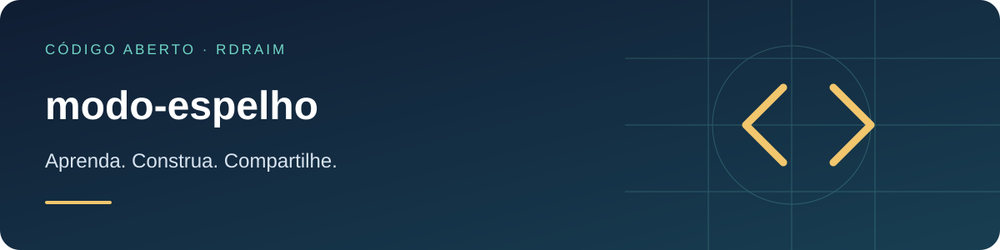

<p align="right">
  <a href="README.md"></a>
  <a href="README.en-US.md"></a>
  <a href="README.es-AR.md"></a>
</p>

# modo-espelho



<!-- public-badges:start -->
[](LICENSE) [](https://github.com/Rdraim/modo-espelho/actions) [](https://github.com/Rdraim/modo-espelho/releases)
<!-- public-badges:end -->

<p>
  <a href="https://github.com/Rdraim/modo-espelho/tree/main/examples"></a>
  <a href="https://github.dev/Rdraim/modo-espelho"></a>
  <a href="https://github.com/Rdraim/modo-espelho/archive/refs/heads/main.zip"></a>
</p>


Declare capacidades por modo e aplique a autorização no servidor antes da operação.

## Instalação

```bash
git clone https://github.com/Rdraim/modo-espelho.git
cd modo-espelho
npm test
node examples/basic.mjs
```

## Exemplo executável

```js
import {capacidades, permitido, exigir} from './src/index.js';
console.log(permitido({modo:'espelho',acao:'excluir',permissoes:['ler','excluir']}));
```

## API

`capacidades(modo)` retorna cópia da matriz. `permitido({modo, acao, permissoes})` exige interseção de modo e identidade. `exigir(contexto)` lança erro com `code: ACESSO_NEGADO`. Modos: principal, espelho somente leitura e offline com rascunhos.

## Limites

Referência de autorização, não motor de sincronização ou backup. Obtenha modo e permissões de contexto confiável do servidor; não aceite valores vindos do navegador. O consumidor é responsável por chamar exigir em todas as operações e por revalidar rascunhos na reconexão.

## Compatibilidade

Núcleo sem dependências de runtime. Node.js 22 e 24 na CI. Instalação pelo Git; não há pacote deste projeto publicado no npm. Consulte Releases e fixe uma tag/commit ao integrar. Atualizações de dependências exigem análise de licença, engines e testes do consumidor. Um badge de CI não certifica segurança.

[Compatibilidade](COMPATIBILITY.md) · [Contribuição](CONTRIBUTING.md) · [Segurança](SECURITY.md)

MIT © Rodrigo Rodrigues

## ☕ Me pague um café

Este projeto te ajudou a resolver um problema, aprender algo novo ou dar os primeiros passos no desenvolvimento? Se você sentir vontade de apoiar meu trabalho, um café é uma forma carinhosa de agradecer.

Sou **Rodrigo Rodrigues**, criador do **Nexus** e destes projetos de código aberto. Seu apoio me ajuda a dedicar tempo para melhorar o código, escrever exemplos mais claros e continuar compartilhando o que aprendo.

**Contribua com o valor que fizer sentido para você. O apoio é totalmente voluntário — o projeto continua gratuito sob a licença MIT.**

<p>
  <a href="#apoie-com-pix"></a>
  <a href="https://github.com/techrodrigo21-ux/modo-espelho/issues/new?title=Coment%C3%A1rio%3A%20este%20projeto%20me%20ajudou"></a>
</p>

### Apoie com Pix

No aplicativo do seu banco, escaneie o QR Code ou copie a chave Pix abaixo. Escolha o valor e confira os dados do destinatário antes de confirmar.

<p align="center">
  
</p>

**Chave Pix**

```text
8875a24e-44d1-4c91-b6bb-62c9f0070955
```

Você também pode apoiar compartilhando o projeto, relatando um problema, melhorando a documentação ou deixando um comentário.

### Seu comentário também faz diferença

[Conte como o projeto te ajudou](https://github.com/techrodrigo21-ux/modo-espelho/issues/new?title=Coment%C3%A1rio%3A%20este%20projeto%20me%20ajudou). Vou gostar de saber o que você criou, o que aprendeu e o que poderia ficar mais claro para quem está começando.

O comentário é bem-vindo com ou sem doação. Preserve sua privacidade: não publique comprovantes, dados pessoais, credenciais ou informações de usuários nas Issues.

---

**Obrigado por apoiar meu trabalho e me ajudar a continuar criando e compartilhando. ❤️**
